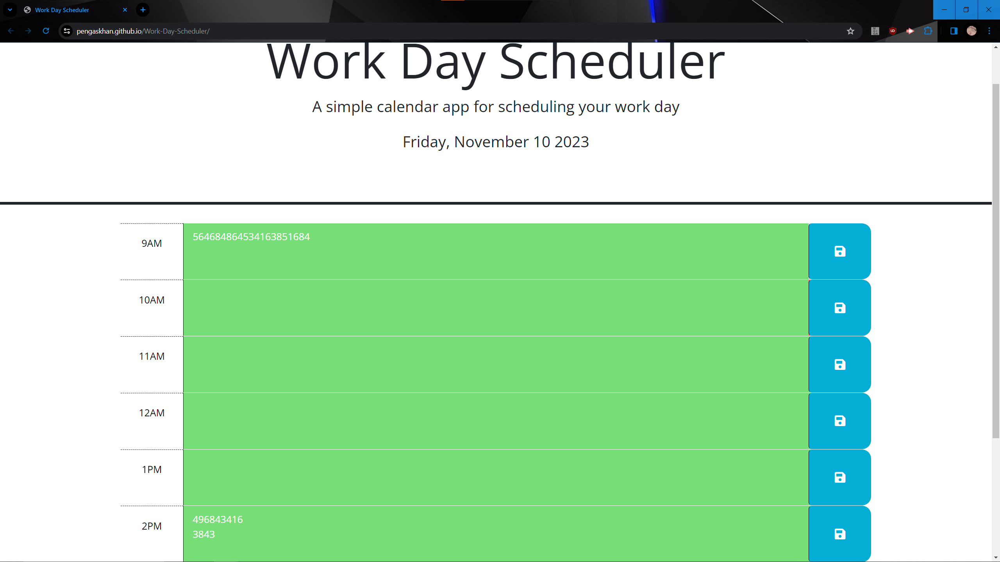

# Work Day Scheduler 

## Description

Challenge submission for Module 5 by Connor Ness. I used the Module 5 mini project to start off the formatting of the js, and had the help of my tutor, Phil Loy, on getting the for loop running.

Github Repo: [https://pengaskhan.github.io/Work-Day-Scheduler/](https://pengaskhan.github.io/Work-Day-Scheduler/)

Deployed Application: [https://pengaskhan.github.io/Work-Day-Scheduler/](https://pengaskhan.github.io/Work-Day-Scheduler/)

## Table of Contents

- [Installation](#installation)
- [Usage Information](#usage)
- [Contribution Guidelines](#contribution)
- [Testing Instructions](#tests)
- [License Information](#license)
- [Contact info for Questions](#questions)

## Installation

npm i; node index.js

## Usage

Set up your schedule for the rest of your work day, and have it available when you load it up again later.

## Contribution

Go nuts

## Tests

## License

This repo is covered by an MIT license
[Link to Liscense information](https://choosealicense.com/licenses/mit/)

## Questions

[Github Profile: https://github.com/PengasKhan](https://github.com/PengasKhan)

Email: cheesepuff42@gmail.com

